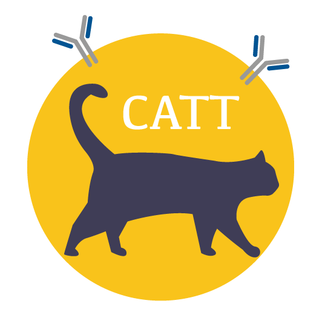
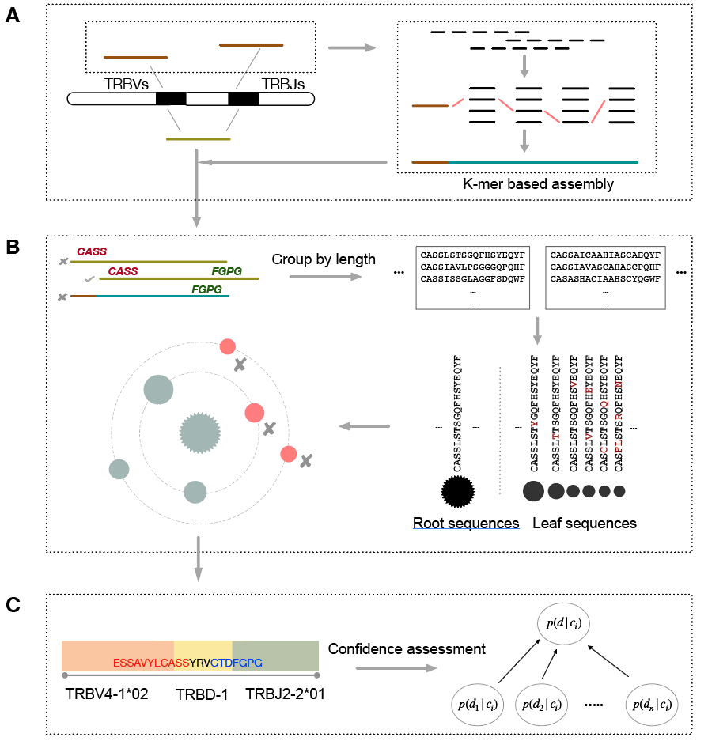

# CATT Homepage



# **CATT**

---

An ultra-sensitive and accurate tool for characterizing **T cell receptor sequence** in bulk and single cell TCR-Seq and RNA-Seq data. The tool can be found in:

- HomePage: [http://bioinfo.life.hust.edu.cn/CATT](http://bioinfo.life.hust.edu.cn/CATT/Homepage.html)
- Github: [https://github.com/GuoBioinfoLab/CATT](https://github.com/GuoBioinfoLab/CATT)

# Overview

---

**CATT**(**C**har**A**cterzing **T**CR reper**t**oires) is a tool for detecting CDR3 sequences from any TCR containing raw sequencing data (including TCR-seq, RNA-seq, scRNA-seq and any TCR contained sequencing data)

The tool has the following feature:

- One-button: CATT employs a totally data-driven algorithm, which is self-adaption to input data without any additional parameters.
- Precisely and efficiently extract T cell CDR3 sequences from most types of TCR containing raw sequencing data. Based on specially designed assembly, CATT could recover more CDR3 sequences than other tools even from short reads.
- Easy installation: Using Docker, CATT can be installed in any platform in one command.



*Overview of the core algorithm of CATT. (A) Candidate CDR3 detection. All reads are aligned to V and J reference genes to select out candidate (brown) reads for micro-assembly. Potential CDR3 sequences were reconstruct by k-1 overlapped k-mers using k-mer frequency based greedy-feasible-flow algorithm. (B) Error correction. The motif criteria from IMGT project were employed to identify putative CDR3 sequences in directly found and assembled CDR3 sequences. CATT eliminates the erroneous CDR3 sequences using a data-driven transition-probability learning algorithms, which retrieves the probability of erroneous CDR3s from the observed CDR3 distribution and merges erroneous sequences (red) according to transition rates based on frequency and Hamming distance between the root and leaf sequences in the same subgroup. (C) Annotation and confidence assessment. After error correction, CATT employs a Bayes classification algorithm to assess the reliability of CDR3 sequences (differ from other protein-coding genes).* 

### Newly update

---

Version 1.7 (2020-03)

* Bug fixes


Version 1.6 (2020-01)

* Bug fixes

* Reduce the startup time

  

Version 1.4 (2019-10)

- Add support for TCR CDR3 profiling for Pig
- Improve multi-thread performance
- Reduce Docker image size

* Current support profiling

  | Chain-Region | Homo spanies | Mus musculus | Sus scrofa |
  | ------------ | ------------ | ------------ | ---------- |
  | TRA - CDR1   | Yes          |              |            |
  | TRA - CDR2   | Yes          |              |            |
  | TRA - CDR3   | Yes          |              |            |
  | TRB - CDR1   | Yes          |              |            |
  | TRB - CDR2   | Yes          | Yes          |            |
  | TRB - CDR3   | Yes          | Yes          | Yes        |
  | IGH - CDR3   | Yes          |              |            |

  

Version 1.3  *(2019-9-4)*

- Refactor code to improve the expandability and performance
- Add support for BCR (IGH CDR3 only)

Version 1.2

- Change from **Python** to **Julia**, improve multi-thread performance.
- Add support for 10X scTCR sequencing data.
- Add support for alpha chain, CDR1, and CDR2

# Installation

### Source code

CATT is written in Julia and python. Download the latest verison and accompanying files from by

```shell
git clone https://github.com/GuoBioinfoLab/CATT.git
```

#### Pre-requisites

To run CATT stand-alone, some packages and softwares are needed:

* Python >= 3.7
  * argparse
* Julia >= 1.0
  * DataFrames
  * CSV
  * GZip
  * BioAlignment
  * BioSequence < 2.0
* BWA
* Samtools

#### Configure

1. Several parameters should be set well in the `reference.jl`

* ref_prefix: The path of resource folder (contain), like `/home/XXX/catt/resource`
* bwa_path: The executive file path of bwa, like `/usr/bin/bwa`. If the bwa is in the $PATH, this can be simply set as `bwa`
* Samtools_path: The executive file path of samtools

2. Several parameters should be set well in the `catt_vX.X.jl`

* In Line 18-20, the absolute path to file `reference.jl`, `Jtool.jl`

3. Several parameters should be set well in the `catt`

*  In Line 47, the path of `config.jl`, make sure it is consistent with the path in `catt_vX.X.jl`

4. make `catt` executable and add it to global variable

   ```Shell
   chmod u+x catt
   #add catt to ~/.bashrc
   export PATH="/path/to/catt:$PATH"
   ```

### Docker Image (recommand)

CATT can also be installed using **Docker**, Docker is a computer program that performs operating-system-level visualization. Using docker, users could easily install CATT and run CATT in virtual environment.

1. Download and install Docker, recommend from [Hompage](https://www.docker.com) (required ubuntu ≥ 14.04 )

2. Download latest CATT docker image
```Shell
docker pull guobioinfolab/catt:latest
```
This command will pull down the CATT from the docker hub (about ~5min needed to download the image, depend on the network speed).  When execution is done,  CATT have been installed successfully.

### Test sample

We prepared a sample file ([testSample.fq](https://github.com/GuoBioinfoLab/CATT/blob/master/testSample.fq), can be downloaded from Github) for user test their installation and illustrating the CATT usage.  **Enter the folder contain the sample file and then run command:**

```Shell
# Docker image
docker run -it --rm -v $PWD:/output -w /output guobioinfolab/catt \
catt -f testSample.fq -o testSampleOutput -t 2

# Source code
catt -f testSample.fq -o testSampleOutput -t 2

```
If all goes well, a CSV format file with name testSampleOutput.TRB.CDR3.CATT.csv should be created in current folder.

Docker command explain:

`—it` and `--rm` flag are used to set docker container attribute, which are not important here.
`-v` will mounts the specified directory on the host inside the container at the specified path. 
In this case, we mounting the `$PWD` (current directory, for linux user only) to `/output` directory inside the CATT image.  We then output the results to this directory as `-o /output/testSampleOutput`. As `/output` is same directory as `$PWD`, you can find the result in the `$PWD` directory outside the CATT image

# Usage

To integrate usage,  users who install the CATT from Docker should always add following settings before command:

```Shell
docker run -it --rm -v $PWD:/output -w /output -u $UID guobioinfolab/catt

#for example, from
catt -f testSample.fq -o testSampleOutput -t 2
#to
docker run -it --rm -v $PWD:/output -w /output guobioinfolab/catt \
catt -f testSample.fq -o testSampleOutput -t 2
```

Where `$PWD` is the path of folder contain your input data (absolute path, or just `$PWD` if input file is in current folder)

### Basic

```shell
# For single-end input:
catt [option] -f inputFile -o outputName

# For paired-end input:
catt [option] --f1 inputFile1 --f2 inputFile2 -o outputName

# For bam input
catt [option] --bam -f inputFile -o outputName
```

option:

- `-t {numberOfThreads}`: number of alignment threads. **default: 4**
- `-sc`: Using Single-Cell mode. Using more aggressive error correction model. For single cell analysis, user should input each cell as a single file.
- `--bam`: Input format is bam/sam.
- `--region`: Analysis CDR region. Could be CDR1/CDR2/CDR3 . **default: CDR3**
- `--chain`: Analysis TCR chain. Could be TRA,TRB,IGH. **default: TRB**
- `--species`: Could be `hs,ms,pig` **default: hs**

> Advance

### Multiple input files

Parameter `-f`  (for paired-end input is `--f1` and `--f2`) and `-o`  can accept multiple input files like:

```Shell
catt [option] -f inputFile1 inputFile2 inputFile3 ... inputFileN \
-o outputName1 outputName2 outputName3 ... outputNameN
```

The input and output should be one-to-one correspondence.

As current version of Julia (v1.1) have a long startup time (~3s, will be fixed in next version), we recommend put all input in one command.

### 10X format data

As 10X sequencing becoming popular nowadays, we add the support for processing 10X scTCR-Seq data (In our evaluation, current 10X scRNA-seq is not suitable for TCR profiling, the reads number and length is under the minimum requirements). CATT will automatically read data, trim UMI, and do TCR profiling. (only support for the current version scTCR toolkit, 150bp paired-end, the first 16bp of Read1 is UMI and barcode sequence). CATT will output TCR for every cell (every barcode), in which some might be empty cell or derived from barcode error. User need to filter out such cells themself. 

    catt [option] --tenX --f1 R1 --f2 R2 -o outputName

> Output explain

The output file of CATT is a CSV format file named like `{prefix}_{chain}_{region}.CATT.csv` . The file contain 7 columns:

- AAseq: The acid amino sequence of TCR/BCR .
- NNseq: The nucleotide sequence of TCR/BCR
- Vregion, Jregion, Dregion: The used V(D)J  gene segment.
- Frequency: The frequency of TCR/BCR
- Probability: The probability of sequence exist in current database (VDJdb and ImmunSEQ). It should be noted that the absolute value of this probability has no biology meaning. Higher the value is just imply the higher probability it occurs in current human-known database.

# **FAQ**

---

- Q: Got `permission denied while trying to connect to the Docker` when try to build docker image

    A: Make sure your user is in the docker group that have permission to use docker command

---

Copyright [Guo Lab](http://bioinfo.life.hust.edu.cn/) , [College of Life Science and Technology](http://life.hust.edu.cn/) , [HUST](http://www.hust.edu.cn/) , China